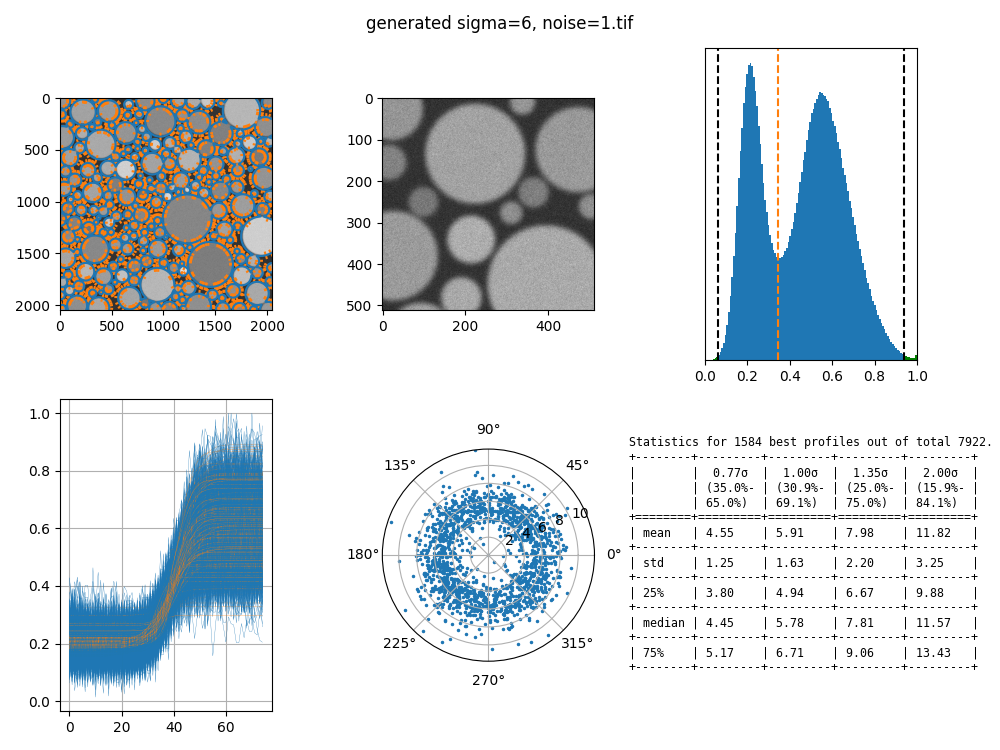

# SEM Resolution

This program is designed to determine SEM resolution form the image of gold nanoparticles on carbon.
[Gaussian profile](https://en.wikipedia.org/wiki/Normal_distribution) is fitted across particle edges, and the width (&sigma;) is reported.


## Instal

Install [Python 3](https://www.python.org/downloads/) according your operating system. 
Then the required libraries:


```
pip3 install -r requirements.txt 
```

## Usage

```
./resolution.py --help
usage: resolution.py [-h] [--crop TOP BOTTOM LEFT RIGHT] [--pixel PIXEL] [--wait] [--interval INTERVAL] [--length LENGTH] [--fraction FRACTION] [FILE [FILE ...]]

Determine SEM resolution.

positional arguments:
  FILE                  *.tif files to process, generates syntetic data if no files are specified

optional arguments:
  -h, --help            show this help message and exit
  --crop TOP BOTTOM LEFT RIGHT
                        crop image margins (default: 0 0 0 0)
  --pixel PIXEL         pixel size (default: 1nm)
  --wait                wait after each image
  --interval INTERVAL   profile interval along contour (default: 10)
  --length LENGTH       profile length (default: 75)
  --fraction FRACTION   fraction of included profiles ordered by fit residual (default: 0.2)
```

## Output


